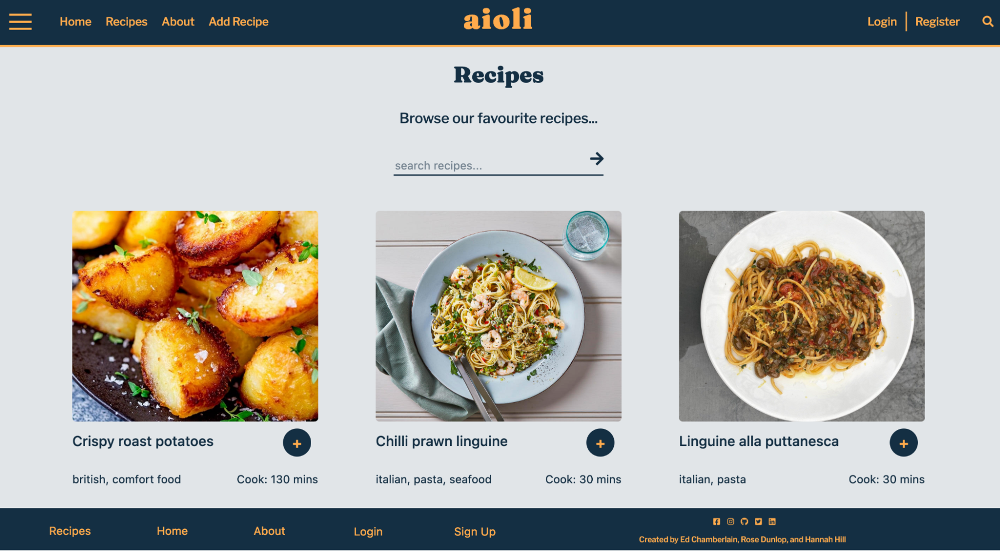
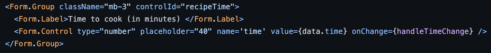
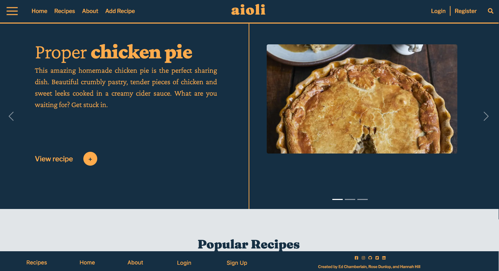
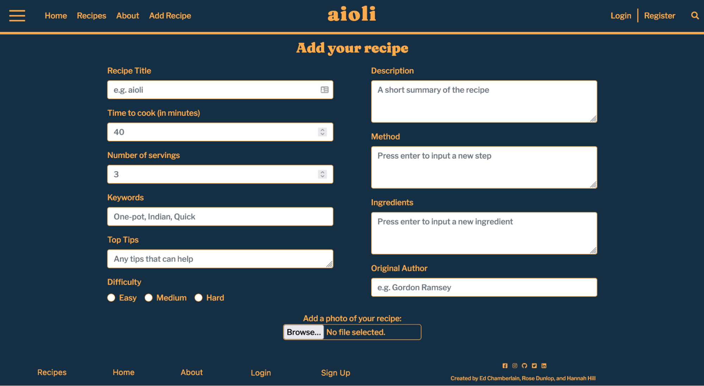

Creators: Hannah Hill, Rose Dunlop and Ed Chamberlain

Project 3 in our General Assembly Immersive Software Egnineering course

# Aioli



## The Brief:

- Build a full-stack application by making your own back-end and your own front-end.
- Use an Express API to serve your data from a Mongo database.
- Consume your API with a separate front-end built with React.
- Be a complete product which most likely means multiple relationships and CRUD functionality for at least a couple of models.
- Implement thoughtful user stories/wireframes that are significant enough to help you know which features are core MVP and which you can cut.
- Be deployed online so it’s publicly accessible.

**Deployed Link:** https://aioli-app.herokuapp.com/

## Overview:

We were split off into groups of three for this project with nine days to complete it, all of us decided on a recipe hosting website so we got to planning quickly.

Using Asana we planned out all the steps we would need to complete to get our MVP and our stretched goals, then assigned them to each other. Once that was completed we used Figma to create wireframes for each page to help us visualise the end goal.


## Technologies Used:

### Back-end:

- Node.js
- Mongodb
- Express
- Bcrypt
- Mongoose
- Body-parsers
- Jsonwebtoken

### Front-end:

- React
- Axios
- Bootstrap
- SCSS
- Http-proxy-middleware
- Nodemon
- React Router DOM
- Cloudinary

### Development-Tools:

- VS Code
- NPM
- Insomnia
- Postman
- Github
- Heroku
- Asana
- Figma

## Approach Taken:

We split the work up amongst the three of us, I did the majority of the back-end whilst the other two filled out our database with recipes. We spent time at the start planning all our models to the letter, and so once it came down to actually writing the code it was very straightforward. I created the bulk of the recipe model (with comments and likes being added later) and added in the unique validator and converted all data to JSON.

```
//Creating our recipe Schema
const recipeSchema = new mongoose.Schema({
  title: { type: String, required: true },
  image: { type: String },
  description: { type: String },
  method: [{ type: String, required: true }],
  ingredients: [{ type: String, required: true }],
  keywords: [{ type: String }],
  time: { type: Number, required: true },
  servings: { type: Number, required: true },
  tips: { type: String },
  difficulty: { type: String },
  author: { type: String },
  owner: { type: mongoose.Schema.ObjectId, ref: 'User', required: true },
  comments: [commentSchema],
  likes: [likeSchema]
})

recipeSchema.plugin(uniqueValidator)
```

I created all the functions for Adding, Editing, Deleting, and Viewing the recipes in the back end.

```

//GET ALL
export const getAllRecipes = async (_req, res) => {
  const recipes = await Recipe.find()
  console.log('Recipes', recipes)
  return res.status(200).json(recipes)
}

//GET SINGLE RECIPE
export const getSingleRecipe = async (req, res) => {
  try {
    const { id } = req.params
    const singleRecipe = await Recipe.findById(id)
      .populate('owner')
      .populate('comments.owner')
      .populate('likes.owner')
    return res.status(202).json(singleRecipe)
  } catch (err) {
    return res.status(404).json({ message: 'Recipe Not Found' })
  }
}

//POST REQUEST
export const addRecipe = async (req, res) => {
  try {
    console.log(req.body)
    const newRecipe = { ...req.body, owner: req.currentUser._id }
    const recipeToAdd = await Recipe.create(newRecipe)
    console.log(recipeToAdd)
    return res.status(201).json(recipeToAdd)
  } catch (err) {
    console.log(err)
    return res.status(422).json(err)
  }
}

//UPDATE BY ID
export const updateRecipe = async (req, res) => {
  try {
    const { id } = req.params
    const recipe = await Recipe.findById(id)
    Object.assign(recipe, req.body)
    await recipe.save({ validateModifiedOnly: true })
    console.log(recipe)
    return res.status(202).json(recipe)
  } catch (err) {
    console.log(err)
    return res.status(404).json({ message: 'Recipe Not Found' })
  }
}

//DELETE RECIPE
export const deleteRecipe = async (req, res) => {
  try {
    const { id } = req.params
    const recipeToDelete = await Recipe.findById(id)
    if (!recipeToDelete.owner.equals(req.currentUser._id)) throw new Error()
    await recipeToDelete.remove()
    const recipes = await Recipe.find()
    return res.status(202).json(recipes)
  } catch (err) {
    console.log(err)
    return res.status(404).json({ message: 'Recipe Not Found' })
  }
}

```

Finally I set up all of the pages in the config file, so creating the environment, making sure all the routes are set up (addRecipe, deleteRecipe, getAllRecipes, getSingleRecipe and updateRecipe) and creating a secure route which utilised json web tokens and introduced the Bearer tokens and how they’re read in the front end.

```

import User from '../models/user.js'
import jwt from 'jsonwebtoken'
import { secret } from '../config/environment.js'

//POST REGISTER
export const registerUser = async (req, res) => {
  try {
    const newUser = await User.create(req.body)
    return res.status(202).json({ message: `Welcome to aioli ${newUser.username}` })
  } catch (err) {
    console.log(err)
    return res.status(422).json(err)
  }
}

//POST LOGIN
//Logs in a user from their username and password
export const loginUser = async (req, res) => {
  try {
    const userToLogin = await User.findOne({ username: req.body.username })
    console.log('USER = ', userToLogin)
    //Check to see if passwords matches the hashed password
    if (!userToLogin || !userToLogin.validatePassword(req.body.password)) {
      throw new Error()
    }
    //Send a token to the user
    const token = jwt.sign({ sub: userToLogin._id }, secret, {
      expiresIn: '7 days',
    })
    return res
      .status(200)
      .json({ message: `Welcome back ${userToLogin.username}`, token: token })
  } catch (err) {
    console.log(err)
    return res.status(422).json({ message: 'Unauthorised' })
  }
}

```

Then wihtin the secure route I added the below:

```

import jwt from 'jsonwebtoken'
import { secret } from './environment.js'
import User from '../models/user.js'

export const secureRoute = async (req, res, next) => {
  try {
    if (!req.headers.authorization) throw new Error()
    const token = req.headers.authorization.replace('Bearer ', '')
    console.log(token)
    const payload = jwt.verify(token, secret)
    console.log(payload)
    const userToVerify = await User.findById(payload.sub)
    if (!userToVerify) throw new Error('Missing Header')
    req.currentUser = userToVerify
    next()
  } catch (err) {
    console.log(err)
    return res.status(401).json({ message: 'Unauthorised' })
  }
}

```

Then once we had moved onto the front-end I added in all CRUD capabilities for the recipes and implemented Cloudinary to be able to host our images and return urls. The Cloudinary code was interesting and really fun to learn how it works, as it was my first time using a .env file. After reading through the documentation and learning what the steps were I needed to take it was incredibly satisfying to get it all working.

```

const uploadUrl = process.env.REACT_APP_CLOUDINARY_URL
const uploadPreset = process.env.REACT_APP_CLOUDINARY_UPLOAD_PRESET

export const ImageUploadField = ({ handleImageUrl, value }) => {

    const handleUpload = async event => {
        const data = new FormData()
        data.append('file', event.target.files[0])
        data.append('upload_preset', uploadPreset)
        console.log('data', data)
        const res = await axios.post(uploadUrl, data)
        console.log('response --> ', res.data.url)
        handleImageUrl(res.data.url)

    }

```

The form for adding in recipes was created using Bootstrap which I now adore, the simplicity of it was brilliant. It took me a short while to understand the documentation, and then for the ‘edit a recipe’ section to pre-populate the data in there, however once I broke it down and spoke to the team about it explaining the issue I figured it out almost straight away (learning the value of a rubber duck!).

A nice touch was when we pulled up the edit a recipe page we have all the data currently there on the page, I figured this out by copying the add a recipe form I had created earlier but by including the value from the data that was there.



Due to the nature of how we set up the backend, the page for viewing all our recipes was incredibly easy to set up, likewise for viewing a single recipe. Which meant we could spend more time on the styling aspects and making the page look as clean as possible.

For each day we would all join Zoom and spend 10 mins in the morning going through what we were going to cover in the day, any issues we faced and any idea that could be added to each segment which meant we could go into each day refreshed and all knowing what the others are doing.

## Visuals:





## Challenges and Wins:

The challenge for this project was most likely working as a trio, however the group I was in worked incredibly well together and all pushed hard to get the best possible product at the end. The biggest win for me would be the planning we did at the start, it meant that every page and every section on the page was planned out and we knew exactly how it should operate.

## Known bugs:

Since deploying, the cloudinary API we used has bugged by not returning the images, so that needs to be worked on. Then the ‘My Recipes’ page has bugged with the request not coming through, another member of the team is looking into this bug as it was their section to complete.

## Future Features / Key Learning:

Key learning would be to plan every cell, but then also to communicate each day so everyone knows exactly what they are doing at any moment in time. I think the reason we worked so well as a team was our abilities to communicate. It just meant that we could express any opinions we had and be met with very open responses.
