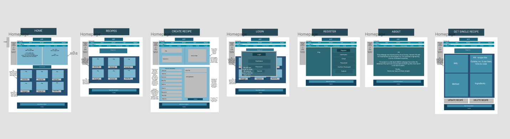
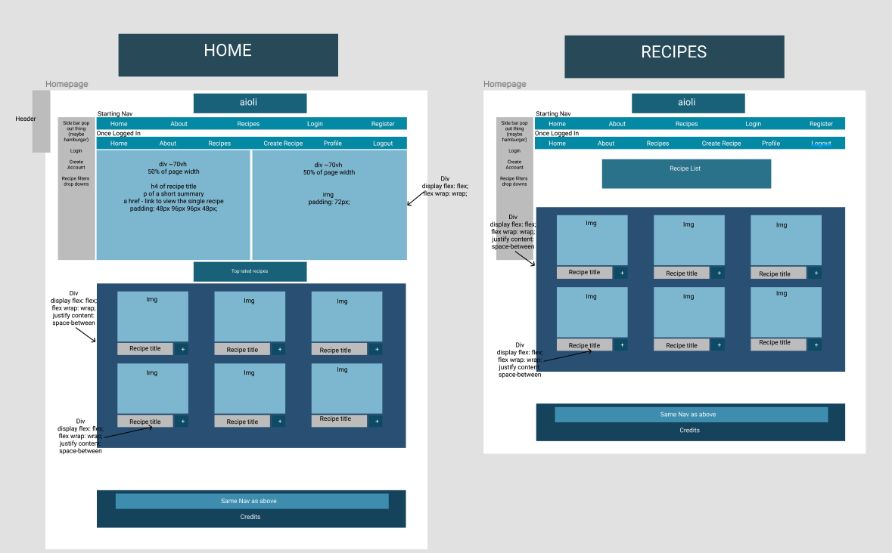

Creators: Hannah Hill, Rose Dunlop and Ed Chamberlain

Project 3 in our General Assembly Immersive Software Egnineering course

# Aioli

## The Brief:

- Build a full-stack application by making your own back-end and your own front-end.
- Use an Express API to serve your data from a Mongo database.
- Consume your API with a separate front-end built with React.
- Be a complete product which most likely means multiple relationships and CRUD functionality for at least a couple of models.
- Implement thoughtful user stories/wireframes that are significant enough to help you know which features are core MVP and which you can cut.
- Be deployed online so it’s publicly accessible.

**Deployed Link:** https://aioli-app.herokuapp.com/

## Overview:

We were split off into groups of three for this project with nine days to complete it, all of us decided on a recipe hosting website so we got to planning quickly.

Using Asana we planned out all the steps we would need to complete to get our MVP and our stretched goals, then assigned them to each other. Once that was completed we used Figma to create wireframes for each page to help us visualise the end goal.




## Technologies Used:

### Back-end:

- Node.js
- Mongodb
- Express
- Bcrypt
- Mongoose
- Body-parsers
- Jsonwebtoken

### Front-end:

- React
- Axios
- Bootstrap
- SCSS
- Http-proxy-middleware
- Nodemon
- React Router DOM
- Cloudinary

### Development-Tools:

- VS Code
- NPM
- Insomnia
- Postman
- Github
- Heroku
- Asana
- Figma

## Approach Taken:

We split the work up amongst the three of us, I did the majority of the back-end whilst the other two filled out our database with recipes. We spent time at the start planning all our models to the letter, and so once it came down to actually writing the code it was very straightforward. I created the bulk of the recipe model (with comments and likes being added later) and added in the unique validator and converted all data to JSON.

```
//Creating our recipe Schema
const recipeSchema = new mongoose.Schema({
  title: { type: String, required: true },
  image: { type: String },
  description: { type: String },
  method: [{ type: String, required: true }],
  ingredients: [{ type: String, required: true }],
  keywords: [{ type: String }],
  time: { type: Number, required: true },
  servings: { type: Number, required: true },
  tips: { type: String },
  difficulty: { type: String },
  author: { type: String },
  owner: { type: mongoose.Schema.ObjectId, ref: 'User', required: true },
  comments: [commentSchema],
  likes: [likeSchema]
})

recipeSchema.plugin(uniqueValidator)
```
